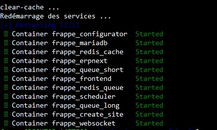
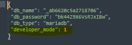

# ERPNext Softia

Ce guide explique comment tester notre application ERPNext Softia dans deux modes :

1. **Méthode rapide** – Installation automatisée via un script shell, pour découvrir l'application sans configuration complexe.
2. **Méthode avancée** – Cloner et exécuter l'application depuis les sources, pour les utilisateurs expérimentés.

---

## Prérequis

- **Docker** (version 27.3 ou plus) et **Docker Compose** (version 2.30 ou plus) installés
- **Git**
- **bench**, **Frappe** et **ERPNext** (requis uniquement pour la méthode avancée)
- Connexion Internet stable

---

## 1. Méthode rapide (recommandée pour découvrir l'application)

Cette méthode lance automatiquement les conteneurs nécessaires (Frappe, ERPNext Softia, etc.) avec les données de démonstration.

### Étapes
1. Clonez le repo :
   ```bash
   git clone https://github.com/SoftiaFR/erpnext_softia_fr
   ```
2. Allez dans le répertoire qu'on vient de cloner :
   ```bash
   cd erpnext_softia_fr
   ```
3. Lancez ce script :
   ```bash
   sudo bash deploy-erpnext_softia.sh
   ```
4. Attendez que des lignes similaires à celles-ci s'affichent :  
   

5. Ouvrez votre navigateur et accédez à :
```
http://localhost:9090
```

- **Nom d’utilisateur** : `Administrateur`
- **Mot de passe** : `admin`

### Pour arrêter l'environnement :
```bash
docker compose down
```

### Pour supprimer également les volumes et repartir de zéro :
```bash
docker compose down -v
```

---

## 2. Méthode avancée (pour utilisateurs expérimentés)

Cette méthode vous permet de cloner le code source de **ERPNext Softia** et de le lancer localement.  
Vous pourrez personnaliser la configuration, modifier le code et tester.

### Étapes
1. Allez dans le répertoire bench:  
   ```bash
   cd /home/frappe/frappe-bench
   ```
2. Créez un site qui s'appelle ``erpnext_softia``
   ```bash
   bench new-site erpnext_softia
   bench --site erpnext_softia add-to-hosts
   ```
3. Activez le mode développeur: éditez site_config.json et ajoutez ``"developer_mode": 1`` si cette ligne n'existe pas encore.
   ```bash
   nano sites/erpnext_softia/site_config.json
   ```
   
4. Installez ERPNext si vous ne l'avez pas encore installé :
   ```bash
   bench get-app erpnext --branch version-15
   bench --site erpnext_softia install-app erpnext
   ```
5. Installez ERPNext Softia
   ```bash
   bench get-app https://github.com/SoftiaFR/erpnext_softia_fr
   bench --site erpnext_softia install-app erpnext_softia_fr
   ```
6. Copiez les fichiers de traduction de Frappe et ERPNext
   ```bash
   cp -f apps/erpnext_softia_fr/locale/frappe_fr.po apps/frappe/frappe/locale/fr.po
   mkdir -p apps/erpnext/erpnext/locale
   cp -f apps/erpnext_softia_fr/locale/erpnext_fr.po apps/erpnext/erpnext/locale/fr.po
   ```
7. Reconstruisez les applications puis relancez le bench
   ```bash
   bench --site erpnext_softia build
   bench start
   ```
8. Accédez ensuite à :
   ```
   http://localhost:8000
   ```

- **Nom d’utilisateur** : `Administrateur`
- **Mot de passe** : `admin`

---
